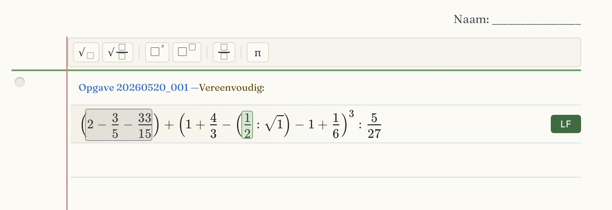
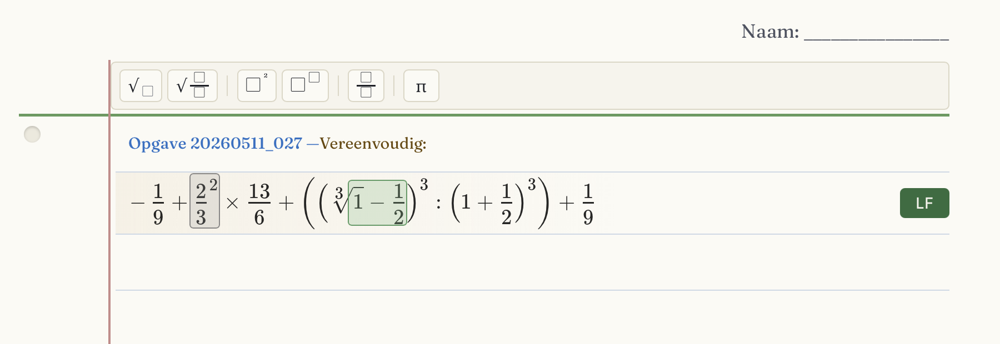

# Hint-lokalisatie: twee anomalieën (geparkeerd, 2026-07-04)

Gevonden bij het breder testen van de gecombineerde hoog+laag-hints (v168). Beide
zijn PRÉ-EXISTENT — niet veroorzaakt door de combinatie; de individuele
kader-verankering is ongewijzigd. Los spoor, apart van de LF-keten.

## 1. 520-001 — genest mathblock knipt het kader af (studenttool / genLatexTokens)

Expressie bevat `(1/2 : √1)`. In de AST:
- `A1` = de **deling** `1/2 : √1` (node_map operation-pad = de `Divide`-knoop,
  output −1/2).
- `A0` = de `√1` erbinnen, een **eigen** mathblock (`√`, output 1), pad = de
  `Sqrt`-knoop ín A1.

`genLatexTokens` tagt elke token met het DIEPSTE omvattende mathblock (`mbForPath`
loopt omhoog). De `√1`-tokens vallen dus onder A0, waardoor A1's kader alleen
`1/2 :` dekt en niet de hele deling. Visueel lijkt het "om 1/2" te staan.

**Kern:** een mathblock-kader dat een genest sub-mathblock omvat, wordt door de
token-tagging opgeknipt. Mogelijk gewenst gedrag (A0 en A1 zijn aparte stappen),
mogelijk te verbeteren (A1-kader zou de hele deling incl. de √1-plek kunnen dekken).

## 2. 511-027 — vermoedelijke AST↔LaTeX-mismatch (authortool / data)

De editor **rendert** `³√(1 − 1/2)` (derdemachtswortel van `1−1/2`), maar de **AST**
is `Add(Root(1,3), −1/2)` = `(³√1) − 1/2` = 1 − 1/2 = 1/2 (dat is A1, een `+`-
optelling; A0 = `³√1`, output 1).

`³√(1/2)` ≠ `1 − 1/2` → de getoonde LaTeX en de AST zijn wiskundig verschillend.
Het groene A1-kader (`³√1 − 1/2`) valt door die afwijkende rendering op `1−1/2`.

**Kern:** waarschijnlijk een authortool/opgave-data-kwestie (de begin-LaTeX matcht
de AST-structuur niet), niet de studenttool-hint. Eerst verifiëren welke van de
twee (LaTeX of AST) de bedoelde opgave is.

**Aanvullende observaties (Henk, 2026-07-04):**
- Het **grijze** (laag) kader dekt `2²/3` in z'n geheel, terwijl alleen `2²`
  omkaderd hoort te worden. In de AST is dit blok `A2 = (2/3)²` (Power van de breuk
  2/3, output 4/9) — dat rendert als `2²/3`, wat opnieuw op een AST↔render-verschil
  wijst (zoals de ³√ hierboven: `(2/3)²` = 4/9 vs `2²/3` = 4/3).
- Er zijn méér bewerkingen die **groen (hoog)** omkaderd zouden kunnen worden, bv.
  `1 + 1/2` (`B1`, `+`, output 3/2) — die verschijnt nu niet als hoog-hint. Te
  onderzoeken: worden alle beschikbare hoog-blokken van de step wel getekend?

## Screenshots

Bewaar de twee screenshots met deze namen NAAST dit document (`studenttool/`),
dan renderen ze hieronder:

- `anomalie_520_001.png` — groen kader op `1/2` (deling i.p.v. breuk-waarde).
- `anomalie_511_027.png` — grijs kader om `2²/3` (moet `2²`), groen om `1−1/2`.

## Verificatie-ingang
- `JSON.stringify(__toonHintBeide())` op elke opgave toont `teTonen` + `perBlock`.
- `__dumpCurrentTree()` / de opgave-`metadata.expressie.ast` voor de boomvorm.
